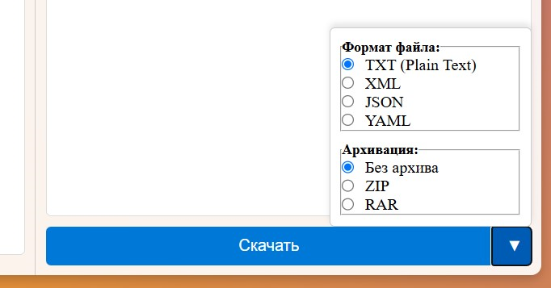

## Задача
Создать web-service, который красиво читает данные из входного файла, обрабатывает их тремя способами(без и с регулярными выражениями; со сторонней библеотекой) и записывает в выходной файл(формата на выбор). Может обрабатывать заархивированные и зашифрованные файлы.
Цель проекта- познакомиться с многи аспектами промышленного программирования, поэтому я сделал также ещё и реализацию предзагрузчика страницы. Для тренировки :)

 
 
 
 
### Возможности проекта:
1. Чтение файла (txt/json/xml/yaml/zip/pdf/docs)
2. Извлечение из архива файла (поддерживаемые форматы zip/tar)
3. Нахождение и обработка математических выражений 
4. Архивация выходного файла
5. Запись вычисленных математических выражений в файл
6. Шифрование/дешифрование файла
7. Использование сайта/оконного/консольного интерфейса
8. Добавление пользовательских функций включения музыки на фон
9. Запуск веб-сервиса (REST)

## Используемые технологии и паттерны:
- **Design Patterns**: Abstract Factory, Decorator, Singleton
- **Форматы файлов**: plain text, XML, JSON, YAML, PDF, docs(Word-document)
- -**Архивы**: ZIP
- **Библиотеки**:
- **Шифрование**: 
- **Тестирование**: Jest

### Монолит
Монолитный паттерн (или монолитная архитектура) — это стиль проектирования,
при котором все компоненты системы или приложения собраны в одном едином целом.
В монолитной архитектуре все модули и функции, такие как бизнес-логика, пользовательский 
интерфейс и данные, обычно интегрированы и реализуются в одном кодовом репозитории или одном исполнимом файле.

## Основные характеристики монолитной архитектуры:
Единый код: Весь код приложения (бизнес-логика, интерфейс и т. д.) находится в одном проекте или одном большом репозитории.
Трудности в масштабировании: Масштабирование монолитного приложения сложнее, поскольку оно не разделяется на независимые компоненты.
Трудности в обновлениях и поддержке: Любые изменения или обновления требуют перезапуска всей системы. Это может привести 
к сбоям в работе приложения, если какая-то часть системы не протестирована должным образом.
Проблемы с гибкостью: Монолитные приложения сложны для адаптации или внесения изменений, если они становятся большими, так как 
одна маленькая ошибка в коде может повлиять на весь проект.

## Структура проекта:
### script.js
- **Функции для работы**

### style.css
- **Стиль проекта**

### design.html
- **html-разметка страницы проекта**
  
### Unit-Тесты:
Проект включает в себя тестирование трех основополагающих функций
- **handleFiles**
- **renderPDF**
- **renderWord**

## Материалы:
- "Чистая архитектура: принципы дизайна"
- "Экстремальное программирование"
- "Паттерны объектно-ориентированного проектирования"
- "Философия Java"
- "Unit Testing- 2020"
- "Объектно-Ориентированный анализ и проектирование"(Гради Буч)
  
## Запуск проекта:
Cамый простой способ- через VS Code

